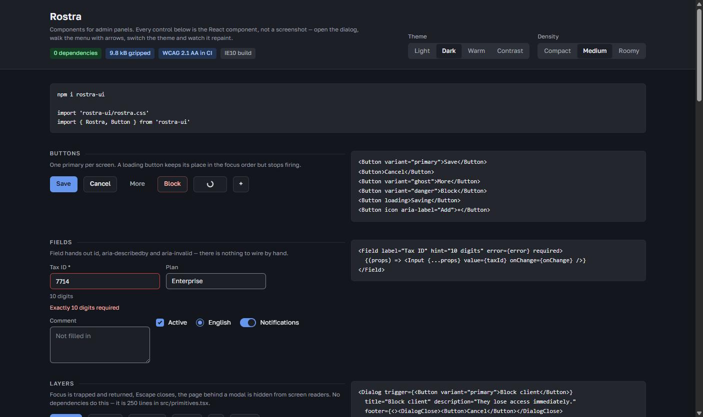

# Rostra

A component system for admin panels and internal corporate tools. Four themes,
four densities, no dependencies, and a CSS core that works without React at all.

[](https://www.npmjs.com/package/rostra-ui)
[](https://github.com/maxyotka/rostra/actions/workflows/ci.yml)
[](LICENSE)

[](https://maxyotka.github.io/rostra/examples/playground.html)

<sub>The screenshot is a link to the playground, where the same components are live.</sub>

---

## Installation

```bash
npm i rostra-ui
```

```tsx
import 'rostra-ui/rostra.css'
import { Rostra, Button } from 'rostra-ui'

<Rostra theme="light" density="medium">
  <Button variant="primary">Save</Button>
</Rostra>
```

The React layer is optional. Without a bundler the same system is one file and
a class name:

```html
<link rel="stylesheet" href="rostra.css">
<div class="rs" data-theme="light" data-density="medium">
  <button class="rs-btn rs-btn--primary">Save</button>
</div>
```

Theme and density are attributes on any container, so a light workspace and a
dark monitoring panel can live in the same application.

Nothing is installed alongside it. `dependencies` is empty, React and
react-dom are peers, and the whole package — CSS core, React layer, every
component — is 9.8 kB gzipped.

## How it works

**Density.** `data-density` sets control height, card padding and table row
padding. A component reads those values and has no size variants of its own.

**Form controls.** Checkbox, radio and switch are native `input` elements under
`.rs-choice`, so form submission, keyboard support and the mobile OS pickers
work with JavaScript switched off.

**Contrast.** `npm run check:contrast` measures 23 foreground/background pairs
in each of the four themes, against the oklch values and against their sRGB
fallbacks. CI fails below WCAG 2.1 AA.

**Old browsers.** `rostra.legacy.css` is generated from the same source for
IE10 and browsers back to 2012. The modern build carries nothing on its behalf.

**Layers.** Dialog, drawer, popover, tooltip and menu are written here, on the
APG patterns: focus trapping with return, Escape and outside-click dismissal,
`aria-hidden` on the rest of the page while a modal is open, and anchoring that
flips when the side runs out of room. Same for calendar, combobox, tree, tabs
and board.

**Size.** A button costs 1.0 kB gzipped, a table screen 1.6 kB, the entire
package 10.7 kB. Tree-shaking works because nothing imports a shared runtime.

**Right to left.** `dir="rtl"` on any container mirrors everything inside it,
including the arrow keys in the calendar, the tree and the tabs. It costs no
support: the mirroring is attribute selectors, not logical properties, so the
legacy build flips as well. [docs/theming.md](docs/theming.md#right-to-left)

**Server rendering.** Every component renders without a DOM; closed layers emit
nothing and their triggers arrive complete, so the page works before hydration.
`tests/ssr.test.tsx` runs the whole system through `renderToString` in a node
environment.

## What it costs

`npm run check:size` measures the published builds with esbuild — minified,
gzipped, React external — and CI runs it with `--check` against a budget, so
these numbers cannot drift unnoticed:

| Import | Rostra | Mantine 9.5.1 | Radix Themes 3.3.0 |
| --- | --- | --- | --- |
| A button | **1.0 kB** | 12.2 kB | 5.2 kB |
| A screen: shell, filters, fields, table, badges | **1.6 kB** | — | — |
| Button, table, badge, dialog, text input | **2.5 kB** | 32.2 kB | 36.8 kB |
| Every component in the package | **10.7 kB** | 180.9 kB | 85.0 kB |
| Stylesheet | **13.3 kB** | 37.9 kB | 86.2 kB |
| Packages installed | **0** | 27 | 84 |

The other two columns were measured the same way on 2026-08-18, with the
versions named in the header; `check:size` itself installs nothing and measures
Rostra only. What the first row shows is a base runtime: both libraries load
theirs with the first import, and Rostra has none. What it does not show is
component count — Mantine ships 116 components to our 55, and a headless
library such as Base UI or React Aria ships behaviour with no stylesheet at
all, so its CSS column would be whatever you write yourself.

A first screen is the honest total — a button plus the whole stylesheet, since
ours is one file and loads in full: **14.3 kB** against Mantine's 50.1 kB and
Radix Themes' 91.4 kB.

## Documentation

| Document | Contents |
| --- | --- |
| [Principles](docs/principles.md) | The eight rules the system is built on, and the writing guidelines |
| [Theming](docs/theming.md) | Tokens, custom themes, density, building your own palette |
| [Accessibility](docs/accessibility.md) | Contrast policy, control borders, what the system does not do for you |
| [Browser support](docs/browser-support.md) | Support floor per browser, the legacy build, how to serve both |
| [Recipes](docs/recipes.md) | Common screens: layout, forms, confirmation dialogs, notifications |
| [API reference](docs/api.md) | Every prop of every component, generated from the shipped types |

## Examples

**[Open the playground →](https://maxyotka.github.io/rostra/examples/playground.html)** — the React
components themselves, with the code beside each one. Open a dialog, walk a
menu with the arrow keys, switch theme and density and watch it repaint.

To run it locally, build the bundle and serve the repository root:

```bash
npm run build:playground
python -m http.server 5501   # then open /examples/
```

Every component is checked with axe-core against WCAG 2.1 A/AA in CI and
reports no violations.

## Browser support

| Build | Browsers |
| --- | --- |
| `rostra.css` | Chrome 84+, Firefox 63+, Safari 14.1+, Edge 84+ |
| `rostra.legacy.css` | IE10+, Chrome 21+, Firefox 28+, Safari 6.1+, Opera 15+ |

Both floors come from caniuse data. `npm run check:support` prints the table and
names the feature that sets each limit. Details and the TLS caveat are in
[docs/browser-support.md](docs/browser-support.md).

## Development

```bash
npm ci
npm run verify   # tokens, contrast, types, tests
npm run build    # css, legacy build, js, types, api reference, playground
```

See [CONTRIBUTING.md](CONTRIBUTING.md) for the workflow, [CHANGELOG.md](CHANGELOG.md)
for history, and [SECURITY.md](SECURITY.md) for reporting vulnerabilities.

## Status

Version 0.2.1, and the API may still change in minor releases — 0.x means what
semver says it means.

Every component in the library has a React counterpart. Dragging on the board
is not implemented: the move controls are buttons, which is what a keyboard and
a screen reader can use.

Not covered yet: print styles, visual regression tests, verification on a real
IE11 rather than a simulated one, and a screen reader pass — axe checks
structure, it does not tell you how NVDA reads a screen.

## License

[MIT](LICENSE)
