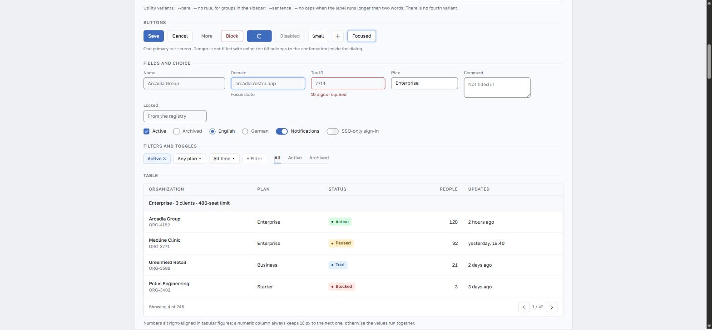

# Rostra

A component system for admin panels and internal corporate tools. Four themes,
four densities, a CSS core with no dependencies, and an optional React layer.

[](https://www.npmjs.com/package/rostra-ui)
[](https://github.com/maxyotka/rostra/actions/workflows/ci.yml)
[](LICENSE)



<sub>A client registry built on the same tokens, dark theme:
[screenshots/prototype-clients-dark.jpg](screenshots/prototype-clients-dark.jpg)</sub>

---

## Installation

```bash
npm i rostra-ui
```

```tsx
import 'rostra-ui/rostra.css'
import { Rostra, Button } from 'rostra-ui'

<Rostra theme="light" density="medium">
  <Button variant="primary">Save</Button>
</Rostra>
```

The React layer is optional. Without a bundler the same system is one file and
a class name:

```html
<link rel="stylesheet" href="rostra.css">
<div class="rs" data-theme="light" data-density="medium">
  <button class="rs-btn rs-btn--primary">Save</button>
</div>
```

Theme and density are attributes on any container, so a light workspace and a
dark monitoring panel can live in the same application.

"No dependencies" applies to the CSS core, which is one file and nothing else.
The React layer sits on five Radix primitives (dialog, dropdown menu, popover,
tabs, tooltip), so installing it brings their tree with it — around 45 packages.
Take `rostra.css` alone and you install nothing.

## What it does differently

- **Density is a token, not a variant.** `data-density` changes control height,
  card padding and table row padding. Components do not know which mode they
  render in.
- **The core runs without JavaScript.** Checkbox, radio and switch are real
  `input` elements styled through `.rs-choice`, so forms, keyboard and mobile
  OS behaviour come for free.
- **Contrast is verified, not claimed.** 23 foreground/background pairs across
  4 themes, checked in CI against WCAG 2.1 AA — in both the oklch and the sRGB
  fallback values.
- **Old browsers get their own build.** `rostra.legacy.css` supports IE10 and
  browsers from 2012 without changing anything in the modern build.
- **Behaviour is not hand-rolled.** Dialogs, popovers, menus and tabs sit on
  Radix primitives; focus traps, positioning and ARIA are not reimplemented.

## Documentation

| Document | Contents |
| --- | --- |
| [Principles](docs/principles.md) | The eight rules the system is built on, and the writing guidelines |
| [Theming](docs/theming.md) | Tokens, custom themes, density, building your own palette |
| [Accessibility](docs/accessibility.md) | Contrast policy, control borders, what the system does not do for you |
| [Browser support](docs/browser-support.md) | Support floor per browser, the legacy build, how to serve both |
| [Recipes](docs/recipes.md) | Common screens: layout, forms, confirmation dialogs, notifications |

## Examples

**[Open the live pages →](https://maxyotka.github.io/rostra/examples/)**

The component library and two clickable prototypes are `.html` files in the
repository root. They render from a static server — no build step:

```bash
python -m http.server 5501   # from the repository root
```

- [`examples/`](examples/index.html) — index of the three pages
- `rostra-library.html` — every component, with theme and density switches
- `prototype-clients.html` — a registry screen: filters, drawer, dialog, toasts
- `prototype-dispatch.html` — a request board with SLA timers and a live feed

Each page is checked with axe-core against WCAG 2.1 A/AA and reports no
violations.

## Browser support

| Build | Browsers |
| --- | --- |
| `rostra.css` | Chrome 84+, Firefox 63+, Safari 14.1+, Edge 84+ |
| `rostra.legacy.css` | IE10+, Chrome 21+, Firefox 28+, Safari 6.1+, Opera 15+ |

Both floors are derived from caniuse data, not guessed: `npm run check:support`
prints the table and names the feature that sets each limit. Details and the
TLS caveat are in [docs/browser-support.md](docs/browser-support.md).

## Development

```bash
npm ci
npm run verify   # tokens, contrast, types, tests
npm run build    # css, legacy build, js, types
```

See [CONTRIBUTING.md](CONTRIBUTING.md) for the workflow, [CHANGELOG.md](CHANGELOG.md)
for history, and [SECURITY.md](SECURITY.md) for reporting vulnerabilities.

## Status

Version 0.1.0. The API may still change in minor releases.

Not covered yet: React wrappers for Calendar, Combobox, Tree and Board; print
styles; visual regression tests; verification on a real IE11 rather than a
simulated one.

## License

[MIT](LICENSE)
